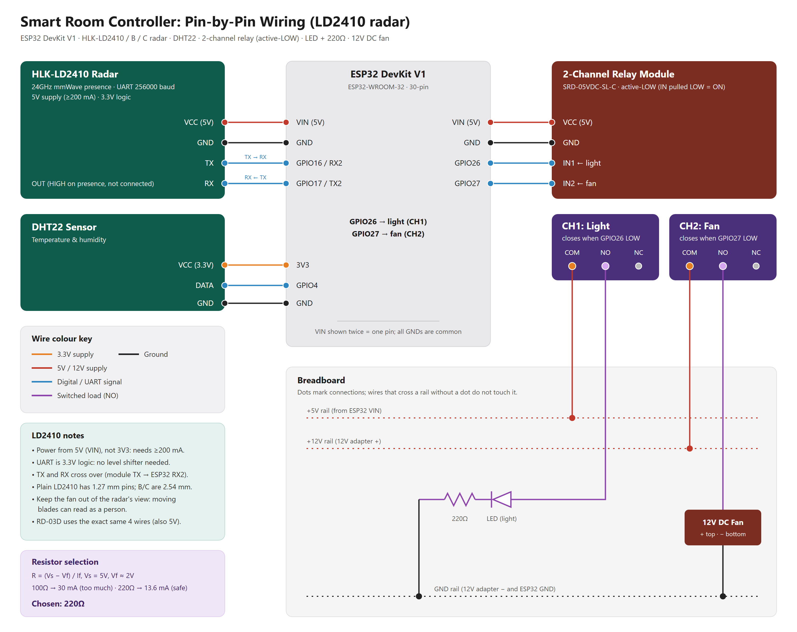

# ESP32 Smart Room Controller

An ESP32 that switches a room's **light** on when someone is present and a **fan** on when someone is present *and* the room is hot/humid. Presence comes from a 24 GHz mmWave radar, climate from a DHT22, and everything is mirrored to (and controllable from) a Firebase Realtime Database.

Two radars are supported and you can switch between them with one line:

| | **HLK-LD2410 / B / C** (default) | **Ai-Thinker RD-03D** |
|---|---|---|
| Detects | Moving **and stationary** people (breathing) | Moving targets, x/y position of up to 3 |
| Good for | Keeping the light on while someone sits still | Tracking, human/animal classifier |
| Range | ~6 m (9 gates × 0.75 m) | ~8 m |
| Wiring | 5V, GND, TX, RX | same |

## Hardware

- ESP32 DevKit V1 (ESP32-WROOM-32, 30-pin)
- HLK-LD2410 / LD2410B / LD2410C **or** Ai-Thinker RD-03D radar
- DHT22 temperature/humidity sensor
- 2-channel 5V relay module (SRD-05VDC-SL-C, active-LOW)
- LED + 220 Ω resistor (stand-in for the light), 12V DC fan + 12V adapter
- Breadboard and jumper wires

## Wiring



Editable sources: [wiring_ld2410.svg](wiring_ld2410.svg) (LD2410) and [wiring_RD-03D.svg](wiring_RD-03D.svg) (RD-03D). The wiring is identical for both radars. The older [home_automation_wiring_white_bg.png](home_automation_wiring_white_bg.png) labels the RD-03D supply as 3.3V, but the datasheet specifies **5V**; use the new diagrams instead.

| From | Pin | To ESP32 | Notes |
|---|---|---|---|
| Radar | VCC | VIN (5V) | Needs ≥200 mA; do **not** use 3V3 |
| Radar | GND | GND | |
| Radar | TX | GPIO16 (RX2) | Crossed over |
| Radar | RX | GPIO17 (TX2) | Crossed over |
| Radar (LD2410) | OUT | not connected | Goes HIGH on presence; optional |
| DHT22 | VCC | 3V3 | |
| DHT22 | DATA | GPIO4 | |
| DHT22 | GND | GND | |
| Relay | VCC | VIN (5V) | |
| Relay | GND | GND | |
| Relay | IN1 | GPIO26 | Light |
| Relay | IN2 | GPIO27 | Fan |
| — | — | GPIO33 | Test button to GND (only when `RADAR_CONNECTED false`) |

Load side: CH1 COM → +5V rail, CH1 NO → LED → 220 Ω → GND. CH2 COM → +12V rail, CH2 NO → fan + , fan − → GND.

Both radars use 3.3V UART logic, so they connect straight to the ESP32 with no level shifter. The plain LD2410 has 1.27 mm-pitch pins; the B and C versions use standard 2.54 mm headers.

## Software setup

1. Install the **esp32** board package (Espressif) in the Arduino IDE.
2. Install libraries: **FirebaseClient** (Mobizt) and **DHT sensor library** (Adafruit).
3. Copy [secrets.example.h](secrets.example.h) to `secrets.h` in the sketch folder and fill in your WiFi SSID/password and Firebase API key, database URL, user email and password.
4. Select board **ESP32 Dev Module** and upload. Serial monitor at **115200** baud.

> `secrets.h` is listed in [.gitignore](.gitignore) so it stays out of git. Only share `secrets.example.h`.

## Switching radars

At the top of the sketch:

```cpp
#define RADAR_MODEL   RADAR_LD2410   // or RADAR_RD03D
```

Re-flash, swap the module on the same four wires, and you're done. `/radar/model` in Firebase shows which one is running.

Other compile-time switches:

| Define | Default | Effect |
|---|---|---|
| `RADAR_CONNECTED` | `true` | `false` = use a button on GPIO33 to simulate presence |
| `RADAR_DEBUG` | `true` | Print radar details to serial every 2 s |
| `LD2410_WRITE_CONFIG` | `true` | On boot, set the LD2410's max gate to 8 and its own hold time to 1 s (saved in the module) |
| `RELAY_SELFTEST` | `false` | Click each relay once on boot |
| `FORCE_DEFAULTS_ON_BOOT` | `true` | Overwrite thresholds/relay polarity in Firebase with the sketch values on boot |

## How it works

- **Presence**: a target must be seen for `confirmFrames` consecutive frames to count, and presence is held for `holdMs` after the last detection.
  - *LD2410*: the module reports a state (none / moving / still / both) with distance and energy (0–100) for each. A target counts if it is within `distMinCm`–`distMaxCm` and above the energy minimum.
  - *RD-03D*: detections are gated by speed, distance and angle, tracked with an alpha-beta filter, and checked for straight-line motion. An optional classifier scores gait cadence, turn rate and continuity to reject pets.
- **Light**: on after someone has been present for 3 s (`LIGHT_ON_DELAY_MS`), off when presence ends.
- **Fan**: on when someone is present and temperature > `threshold` **and** humidity > `humidityThreshold` (or **or**, if `fanRequireBoth` is false), with 0.5 °C / 2 % hysteresis.
- **Manual override**: set `lightOverride` / `fanOverride` in Firebase and the `...ManualValue` fields win over automation.

## Firebase

Everything lives under `/rooms/room1`.

**Written by the ESP32**: `temperature`, `humidity`, `occupancy`, `light`, `fan`, `lightPending`, `envTrip`, `dhtOk`, `mode`, `distanceCM`, `radar/model`, `radar/state`, `radar/fps`, `radar/stale`, `radar/rawTarget`, `radar/class`

- LD2410 only: `radar/targetState` (0 none, 1 moving, 2 still, 3 both), `radar/moveCm`, `radar/moveEnergy`, `radar/stillCm`, `radar/stillEnergy`
- RD-03D only: `angleDeg`, `radar/speedCms`, `radar/groundCms`, `radar/ratio`, `radar/track`, `radar/animal`, `radar/humanScore`, `radar/cadenceHz`, `radar/turnDps`

**Read by the ESP32** (change these to control/tune it):

| Path | Meaning |
|---|---|
| `lightOverride`, `lightManualValue` | Manual light control |
| `fanOverride`, `fanManualValue` | Manual fan control |
| `threshold`, `humidityThreshold`, `fanRequireBoth` | Fan climate rules |
| `radar/distMin`, `radar/distMax` | Detection zone, cm |
| `radar/confirmFrames`, `radar/holdMs` | Presence confirm / hold time |
| `radar/ld2410/moveEnergyMin`, `radar/ld2410/stillEnergyMin` | LD2410: ignore targets weaker than this (0–100) |
| `radar/ld2410/useStill` | LD2410: `false` = only moving targets count |
| `radar/angleMax`, `radar/minStraightness`, `radar/stillRadiusMm` | RD-03D gating |
| `classify/*` | RD-03D classifier tuning and `classify/enabled` |
| `relay/lightActiveLow`, `relay/fanActiveLow` | Relay polarity |

Tuning values are re-read every ~15 s.

## Serial output

```
T 27.4C  RH 61.2%  human YES  animal no  (still)  light ON [pin LOW]  fan off [pin HIGH]  mode auto  cls OFF
  radar 10.0 fps
  ld2410 state 2 | moving 0cm e0 | still 142cm e38 | hits 57
```

The value in brackets after `animal` is the radar state: `no target`, `building` (not yet confirmed), `moving`, `still`, `moving+still`, `too near`, `too far`, `weak`, or `still ignored`.

## Troubleshooting

- **`[STALE]` / "Radar silent for 5 s"**: check TX/RX are crossed and the radar has 5V. Both modules default to 256000 baud.
- **Room never goes empty with the fan running (LD2410)**: the fan is being seen as a target. Watch `moveEnergy` / `stillEnergy` on serial with the room empty and raise `radar/ld2410/stillEnergyMin` / `moveEnergyMin` above those values, or aim the radar away from the fan.
- **Relays inverted**: flip `relay/lightActiveLow` / `relay/fanActiveLow` (and set `FORCE_DEFAULTS_ON_BOOT false`, or change the sketch defaults).
- **Fine-tune LD2410 gate sensitivities**: use Hi-Link's **HLKRadarTool** phone app over Bluetooth; settings are stored in the module.

## References

- [HLK-LD2410 Serial Communication Protocol v1.02](https://www.sudo.is/docs/esphome/components/ld2410/HLK-LD2410_Serial_Communication_Protocol_v1.02.pdf)
- [HLK-LD2410C datasheet](https://naylampmechatronics.com/img/cms/001080/HLK-LD2410C_datasheet.pdf)
- [ESPHome LD2410 component](https://esphome.io/components/sensor/ld2410/)
- [Ai-Thinker RD-03D specification](https://en.ai-thinker.com/Uploads/file/20231016/20231016032622_13559.pdf)
